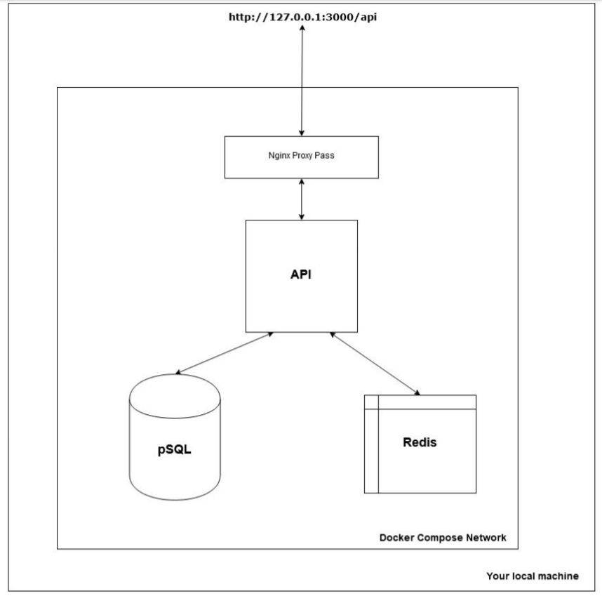

# B3 Devops - TP 2

## Info

**mail**: antinea.gontard@ynov.com

**github_username**: Maengast

## Prérequis
- Docker Desktop
- NodeJs
- Terminal

Docker Desktop ne peut s'installer que sous windows 10 Pro, Entreprise ou Education. Il a fallu donc upgardee l'OS sur une de ces versions.

## Contenu

```
|-- Dockerfile (fichier permettant de créer le conteneur de l'application nodejs et de la configurer)
|-- api.js (application)
|-- package.json (dépendances de l'application)
|-- docker-compose.yml (lien entre les différents containers pour créer notre infrastructure)
|-- nginx
    |-- Dockerfile (fichier permettant de créer le conteneur de Nginx et de le configurer)
    |-- default.conf (configuration de Nginx)
```

## Infrastructure


### Conteneurs et réseaux
  Les conteneurs sont créés et liés pour créer l'infrastructure grâce à `docker compose`.
  
  | Conteneurs | networks |
  |------------|----------|
  | application (api) | network-api |
  | nginx | network-db |
  | redis | |
  |postgres| |
  
  #### Redis & Postgres : 
  Les bases de données sont créés avec une configuration par défaut directement grâce à docker compose
  
  #### Nginx & Application
  Nginx et l'application sont créés et configurés à partir des Dockerfiles correspondant.
  
  #### Les réseaux
  Les réseaux permettent de cloisonner les liens entres les différents conteneurs.
  
   - **network-api** : réseau permettant de communiquer avec l'application.
   - **network-db** : réseau permettant de communiquer avec les bases de données.
  
  
### Lancement
  - Tout d'abord il faut build :   
  `> docker-compose build` 

  - Ensuite lancer l'infrastructure :   
  `> docker-compose up`


## Installation
  - Cloner le repo
  - Une fois dedans , installer les dépendances node :   
    `> npm install`
    
  - Lancer l'infrastructure :   
    `> docker-compose up`
    
## Vérifications
Pour vérifier que notre installation marche : 
  - http://localhost:3000/api
  
  - http://localhost:3000/api/status
